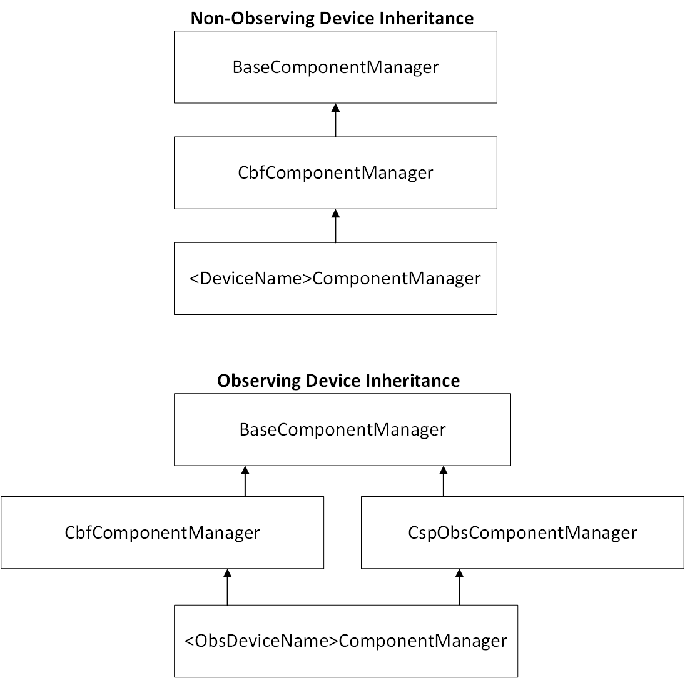

CbfComponentManager Class
---------------------------------
.. autoclass:: ska_mid_cbf_mcs.component.component_manager.CbfComponentManager
   :members:
   :undoc-members:
   :show-inheritance:
   :member-order:

The MCS contains two types of Tango devices: observing and non-observing. 
Non-observing devices contain only an ``op_state_model`` while observing devices
contain both an ``op_state_model`` and ``obs_state_model``. As shown in the inheritance
diagram below, non-observing devices inherit from ``CbfComponentManager`` while observing
devices inherit from ``CbfComponentManager`` and ``CspObsComponentManager``. 

