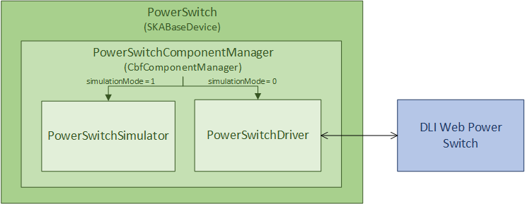

==================
PowerSwitch 
==================

The ``PowerSwitch`` Tango device is used to control and monitor the web power switch 
that provides power to the Talon LRUs. The current power switch in use is the DLI LPC9 (`User Guide
<http://www.digital-loggers.com/downloads/Product%20Manuals/Power%20Control/pro%20manual.pdf>`_). 
The power switch has 8 programmable outlets, meaning that it can power up to 4 Talon 
LRUs (each LRU needs two power supply lines).

The ``PowerSwitch`` device can be operated in either simulation mode or not. When in simulation
mode (this is the default), the ``PowerSwitchSimulator`` is used in place of communication with
the real power switch hardware. This allows testing of the MCS with no hardware connected.

When integration testing with the hardware is desired, the ``simulationMode`` attribute can
be set to 0. This initializes communication with the real power switch via the ``PowerSwitchDriver``,
and queries the list of outlets in the power switch. 

   
   MCS PowerSwitch Device

Important operational notes:

- Certain requests to the power switch hardware can take longer than others, hence a timeout of
  4 seconds set in the ``PowerSwitchDriver``. As such, accessing attributes or commands in the 
  ``PowerSwitch`` device can take longer than the default Tango timeout (3 seconds). Any ``DeviceProxy``
  of the ``PowerSwitch`` device should increase its timeout to 5 seconds to safely complete all requests
  (both successful and unsuccessful) before the Tango timeout. This can be done using
  ``pwr_dev_proxy.set_timeout_millis(5000)``, assuming ``pwr_dev_proxy`` is a ``DeviceProxy`` to 
  the ``PowerSwitch`` device.
- Although the DLI LPC9 claims to support up to 8 concurrent clients, testing has 
  shown a significant slow down in response time when more than one request has been 
  sent to the power switch. As such, all communication with the power switch should be kept 
  sequential. Currently the ``PowerSwitchDriver`` does not ensure this. If the ``PowerSwitch``
  device is ever changed to handle requests asynchronously, the ``PowerSwitchDriver`` should
  also be updated to only process one request at a time. 

PowerSwitch Device Class
-------------------------

.. autoclass:: ska_mid_cbf_mcs.power_switch.power_switch_device.PowerSwitch
   :members:
   :undoc-members:
   :show-inheritance:
   :member-order:

PowerSwitchComponentManager Class
---------------------------------

.. autoclass:: ska_mid_cbf_mcs.power_switch.power_switch_component_manager.PowerSwitchComponentManager
   :members:
   :undoc-members:
   :show-inheritance:
   :member-order:   

PowerSwitchDriver Class
------------------------

.. automodule:: ska_mid_cbf_mcs.power_switch.power_switch_driver
   :members:
   :undoc-members:
   :show-inheritance:
   :member-order:

PowerSwitchSimulator Class
--------------------------

.. automodule:: ska_mid_cbf_mcs.power_switch.power_switch_simulator
   :members:
   :undoc-members:
   :show-inheritance:
   :member-order:   

   