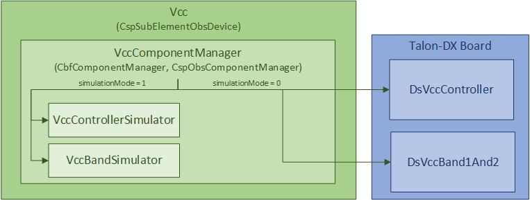
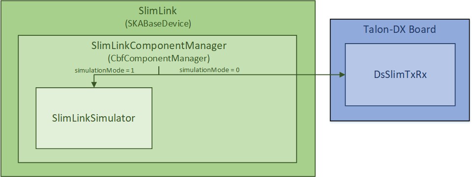

.. Documentation

********************************
Mid.CBF MCS Element Design Notes
********************************

A note on state models
======================================================

There exist a handful of state models implemented in the `SKA control model
<https://developer.skao.int/projects/ska-control-model/en/latest/index.html>`_
that are inherited by MCS devices. Some notes regarding the most important of these, along with the states
used by MCS, and some terminology, are listed here:

* **AdminMode**: when a device's adminMode attribute is set to ONLINE it triggers
  the component manager's ``start_communicating`` method, establishing monitoring and control 
  over the underlying component; when set to OFFLINE, it triggers
  ``stop_communicating``, disengaging component monitoring and control.

  * When the device is "online" (i.e. communications are established with the component, ``AdminMode.ONLINE``),
    its operating state (OpState) is controlled via power state updates (e.g. ON, OFF).

  * When the device is "offline" (i.e. communications with the component are disabled, ``AdminMode.OFFLINE``),
    its operating state is DISABLED.

* **OpState**: an extension of Tango's DevState, this represents both the power and communications
  status of a given device.

  * States used in MCS: ON, OFF, DISABLED.

  * Typically referred to when "powering on" or "powering off" a device, via the On/Off commands.

* **ObsState**: used by observing devices to denote what stage of an observation/scan is in progress.
  This state is driven by observing commands.

  * Normal scan operation states: EMPTY, RESOURCING, IDLE, CONFIGURING, READY, SCANNING.

  * Abort pathway states: ABORTING, ABORTED, RESETTING, RESTARTING.
  
    * Note that subarray resources such as VCC and FSP do not implement EMPTY, RESOURCING and RESTARTING
      states, nor resourcing commands, as they do not require resource allocation before scan configuration.

Devices and Component Managers
======================================================

In the Mid.CBF MCS, each device is comprised of a Tango device class and a component manager class. 
The device class provides a Tango interface, with commands, attributes, properties, and state models, 
while the component manager class performs the actual monitoring and control of the underlying component.
The component manager updates the device's state model(s) (in particular, the ``op_state_model`` and/or ``obs_state_model``)
via callback methods in the device. 

More details about the role of component managers can be found in the `SKA Tango Base Documentation 
<https://developer.skao.int/projects/ska-tango-base/en/latest/concepts/component-managers.html>`_. 
An example of this Tango device and component manager interaction is shown in the diagram below. 

.. figure:: ../../diagrams/component-manager-interactions.png
   :align: center

Cbf Base Class Inheritance
==========================
Cbf decouples itself from ``ska-tango-base`` by extending ``SkaBaseDevice`` and ``SkaObsDevice`` into 
``CbfDevice`` and ``CbfObsDevice``, respectively. Likewise, Cbf component managers are extended 
into ``CbfComponentManager`` and ``CbfObsComponentManager`` from ``TaskExecutorComponentManager``, 
which itself extends ``BaseComponentManager`` to enable aynchronous command execution via Long Running Commands (LRCs).
This choice to decouple from ``ska-tango-base`` gives the MCS freedom to override the base implementation as needed. 
For example, ``CbfObsDevice`` initializes a slightly reduced observing state model that omits the EMPTY and RESOURCING 
states since they are not required by MCS observing devices, with the exception of ``CbfSubarray``.

Cbf Controller
======================================================

The ``CbfController`` Tango device controls communications and power for the following Tango devices: 
``CbfSubarray``, ``Slim``, ``TalonBoard`` and ``TalonLRU``.
It is responsible for setting communications for these subordinate devices online and offline,
setting their simulation mode, as well as powering them on and off.
The ``CbfController`` also propagates system configuration parameters, and initiates
the configuration of the Talon-DX hardware.
The device’s On command triggers a call to ``TalonDxComponentManager.configure_talons``, which copies 
the device server binaries and FPGA bitstream to the Talon-DX boards, starts the HPS master 
device servers, and sends the configure command to each DsHpsMaster device.

Cbf Subarray 
======================================================

The ``CbfSubarray`` Tango device is used to drive scan operations of a Mid.CBF receptor subarray.
This device receives one configuration per scan, and a subarray may accept this scan configuration
only after being assigned at least one receptor.

Receptor assignment
-------------------

Receptor assignment to a subarray is done before configuration for a scan. 
Receptor assignment is exclusive; receptors belonging to one subarray cannot 
belong to any other subarray. Up to 197 receptors can be assigned to one subarray; 
currently, there is only support for 4 receptors.

During a given receptor's assignment, the corresponding VCC device is set online by the subarray.
Upon a receptor's release, the corresponding VCC device is set offline by the subarray. 

Scan configuration
------------------

Subarrays receive a scan configuration via an ASCII encoded JSON string. The scan 
configuration is validated for completeness, then the subarray device will configure
subordinate devices with the relevant parameters, including VCC, FSP, and FSP function
mode subarray devices.

FSPs are assigned to subarrays during scan configuration, and may belong to any
number of subarrays so long as those subarrays are requesting processing for
the same function mode (more details on this below). When an FSP is assigned to its
first subarray, that subarray sets its function mode and sets it online

Frequency Slice Processor (FSP)
======================================================

The ``Fsp`` Tango device is used for monitoring and control of a Frequency Slice 
Processor (FSP) during scan operation. An FSP device can be configured for processing 
of one of up to twenty-six frequency slices (depending on observational frequency 
band). Additionally, an FSP can be assigned to any number of subarrays if they require
processing for the same function mode.

Fsp Function Mode
-----------------

There are four function modes available for FSP scan configuration, each with a 
corresponding function mode subarray device per FSP; furthermore, each FSP function
mode subarray device corresponds to a unique pairing of one FSP with one subarray.
Currently, one subarray and four FSPs are supported.

FSP Function Mode Subarray devices:

* Correlation (CORR): ``FspCorrSubarray``
* Pulsar Search Beamforming (PSS-BF): ``FspPssSubarray``
* Pulsar Timing Beamforming (PST-BF): ``FspPstSubarray``
* VLBI Beamforming (VLBI): ``FspVlbiSubarray``

Mid.Cbf VCC Device Server (Vcc)
===========================================

VCC Device
----------
The ``Vcc`` Tango device is used to control and monitor the functionality for a
single Talon-DX board that runs Very-Coarse Channelizer (VCC) functionality. This device communicates with
the top-level VCC device server running on the Talon-DX board to coordinate
setup and processing activities of low-level device servers.

The ``Vcc`` device can operated  in either simulation mode or not. When in simulation
mode (this is the default), simulator classes are used in place of communication
with the real Talon-DX Tango devices. This allows the testing of MCS without
any connection to the hardware.

   
   MCS Vcc Device

Serial Lightweight Interconnect Mesh (SLIM) Design
==================================================

Ref: :ref:`Serial Lightweight Interconnect Mesh (SLIM) Interface`

Slim
----
The ``Slim`` Tango device provides macro control to aggregated subordinate ``SlimLink`` Tango devices.
It is responsible for turning the subordinate devices on and off, as well as rolling up 
and monitoring important device attributes, such as each link's HealthState. The ``Slim``
device’s ConfigureCommand triggers a call to ``SlimComponentManager.configure``, which 
initializes ``SlimLink`` devices as described in a YAML configuration file.

Since the ``SlimLink`` component that the ``Slim`` device controls is software within MCS, it does not 
require a simulator. Whether being tested or not, the ``Slim`` device always controls the ``SlimLink`` 
MCS devices. It should be noted, however, that the ``Slim`` device still implements a simulation mode,
and it's sole purpose is to set the child ``SlimLink`` device's simulation mode. Therefore, simulation mode 
is set globally within a mesh and cannot be toggled per link.

.. figure:: ../../diagrams/slim-device.png
   :align: center
   
   MCS Slim Device

SlimLink
--------
The ``SlimLink`` Tango device configures a pair of proxies to ``slim-tx`` and ``slim-rx`` HPS devices 
within the ``ds-slim-tx-rx`` device server. It also monitors several of the HPS device's attributes
that are used to update the ``SlimLink`` device's HealthState attribute. The ``SlimLink`` device’s 
ConnectTxRxCommand triggers a call to ``SlimLinkComponentManager.connect_slim_tx_rx``, which 
initializes the target HPS ``ds-slim-tx-rx`` devices by taking them out of serial loopback 
mode, syncing idle control words, etc.

The ``SlimLink`` device can operate in either simulation mode or not. When in simulation
mode (this is the default), simulator classes are used in place of communication
with the real Talon-DX Tango devices. This allows testing of the MCS without
any connection to the hardware.

   
   MCS SlimLink Device

Talon LRU
======================================================

The ``TalonLRU`` Tango device handles the monitor and control functionality 
for a single Talon LRU. A TalonLRU instance must therefore be created for each LRU. 
Currently this device only controls the power to the LRU via a proxy to the ``PowerSwitch`` 
device.

The operational state of this device always reflects the power state of the LRU.
If at least one of the PDU outlets connected to the LRU is switched on, the state 
of the ``TalonLRU`` device should be ON. If both outlets are switched off, then the
state should be OFF.

If the state of the outlets is not consistent with the state of the ``TalonLRU`` device
when it starts up (or when ``simulationMode`` of the ``PowerSwitch`` device changes),
the ``TalonLRU`` device transitions into a FAULT state. The power outlets must then
be manually switched to the expected startup state via some other method before resetting
the ``TalonLRU`` device.

The expected startup state of the device is OFF.

Power Switch
======================================================

The ``PowerSwitch`` Tango device is used to control and monitor the web power switch 
that provides power to the Talon LRUs. The current power switch in use is the DLI LPC9 (`User Guide
<http://www.digital-loggers.com/downloads/Product%20Manuals/Power%20Control/pro%20manual.pdf>`_). 
The power switch has 8 programmable outlets, meaning that it can power up to 4 Talon 
LRUs (each LRU has redundant power supplies).

The ``PowerSwitch`` device can be operated in either simulation mode or not. When in simulation
mode (this is the default), the ``PowerSwitchSimulator`` is used in place of communication with
the real power switch hardware. This allows testing of the MCS with no hardware connected.

When integration testing with the hardware is desired, the ``simulationMode`` attribute can
be set to 0. This initializes communication with the real power switch via the ``PowerSwitchDriver``,
and queries the list of outlets in the power switch. 

.. figure:: ../../diagrams/power-switch-device.png
   :align: center
   
   MCS PowerSwitch Device

Important operational notes:

.. #TODO: Remove? No longer relevant with PowerSwitch commands refactored into LRCs
- Certain requests to the power switch hardware can take longer than others, hence a timeout of
  4 seconds set in the ``PowerSwitchDriver``. As such, accessing attributes or commands in the 
  ``PowerSwitch`` device can take longer than the default Tango timeout (3 seconds). Any ``DeviceProxy``
  of the ``PowerSwitch`` device should increase its timeout to 5 seconds to safely complete all requests
  (both successful and unsuccessful) before the Tango timeout. This can be done using
  ``pwr_dev_proxy.set_timeout_millis(5000)``, assuming ``pwr_dev_proxy`` is a ``DeviceProxy`` to 
  the ``PowerSwitch`` device.
- Although the DLI LPC9 claims to support up to 8 concurrent clients, testing has 
  shown a significant slow down in response time when more than one request has been 
  sent to the power switch. As such, all communication with the power switch should be kept 
  sequential. Currently the ``PowerSwitchDriver`` does not ensure this. If the ``PowerSwitch``
  device is ever changed to handle requests asynchronously, the ``PowerSwitchDriver`` should
  also be updated to only process one request at a time. 

Asynchronous event-driven control structure
===========================================
MCS version 1.0.0 introduces the concept of an event-driven system, which solves some
timing headaches and provides some additional benefits, at the expense of increased complexity.

Long-Running Commands (LRC)
---------------------------
Some operations in the CBF take time and there's no getting around it. Before the event-driven
approach was in place, a workaround used in MCS was to have clients temporarily increase a 
component's timeout from the default 3 seconds before issuing calls, then 
reverting this change after completion. Since this is clearly a hacky solution, an alternative was needed.

Version 1.0.0 of ``ska-tango-base`` introduced the (`LRC protocol 
<https://developer.skao.int/projects/ska-tango-base/en/1.0.0/reference/lrc-client-server-protocol.html>`_). 
By having command classes inherit from ``SubmittedSlowCommand`` rather than ``BaseCommand`` or ``ResponseCommand``, 
clients can no longer expect a result to be returned immediately from command calls. Although they both return a tuple,
LRC return values are different; a fast command returns ``(result_code, message)``, 
whereas the tuple that an LRC immediately returns is ``(result_code, command_id)``, unless the command was rejected, 
in which case the command_id is not generated, and instead replaced with a message to explain the rejection.

An LRC's result_code indicates only whether the command was added to the ``TaskExecutor``'s queue, or was rejected, 
for exmaple, due to the ``TaskExecutor``'s queue being full. Once queued, commands are 
executed within a separate "task-executor thread" running in parallel to the main control thread.
The actual results of LRCs come from published ``longRunningCommandResult`` attribute change events. 
The value of this attribute is a tuple with the slightly odd format, (command_id, result_code_message), 
where command_id is a unique command identifier string, and result_code_message is a list(int, str) 
cast into a string, containing the result_code integer and message string; for example:
``command_id, result_code_message = ('1725379432.518609_238583733127885_RemoveAllReceptors', '[0, "RemoveAllReceptors completed OK"]')``.

One implication of the shift to execute commands in a separate thread is that the structure 
of the command logic had to change to accomodate parallelism. In devices, ``FastCommand``s are 
implemented as an "execution" method and a command class (instantiated during initialization), whose ``do()`` method calls an associated 
function in the component manager; this where the command logic lives. When the command is called by a client, 
the execution method fetches the command class object and runs its ``do()`` method. Additionally, either 
the device implements ``is_<COMMAND>_allowed()`` methods for commands that override a 
baseclass implementation, or else the command class implements an ``is_allowed()`` method for 
novel commands, which these commands' ``do()`` methods use as a condition to guard the 
component manager call, in case a command is called from an invalid state, etc. In contrast, 
LRCs still implement the execution method, but do not implement command classes; instead, 
during initialization a ``SubmittedSlowCommand`` object is instantiated and when the command is executed, 
this object's ``do()`` method is called instead. Rather than just one associated method in the component manager, 
LRCs have two. The first has public scope and is the one called by the ``SubmittedSlowCommand``'s ``do()`` method. 
All this public method does is submit a task to the ``TaskExecutor``'s queue, and among other things, 
this task's arguments include 1. the second, private scoped, associated function, containing all the command's logic, 
and 2. the ``is_<COMMAND>_allowed()`` function, now defined in the component manager rather than the device; 
this is important, as the validity of calling a given command needs to be evaluated when the task is executed rather 
than when the command is called by the client. For this reason, overridden baseclass commands still have an 
overridden ``is_<COMMAND>_allowed()`` method defined in the device, but all it does is return ``True``, 
in order to defer judgement to the component manager's ``is_<COMMAND>_allowed()`` method that will 
run when the command is popped off of the queue.

Another implication of parallelism in MCS is that multiple commands can be queued 
without regard for their results, or even for how long they take to run (at least until their results are needed), 
which solves the hacky updating-command-timeouts workaround. Instead, once queued, LRCs rely on change events to 
communicate their progress. A callback mechanism detects these events and keeps track 
of who is waiting on which results, which is not trivial as this queue opens the door for even further complexity; 
when a 'parent' LRC calls a 'child' command on one of its components that is also an LRC. To manage this confusing use case, 
mutexes (locks in python) are used to block commands from getting too far ahead of their 
components' LRC results by a) keeping track of how many LRCs remain in progress for a given client, and b) enforcing a final (much longer) 
timeout for LRCs, after which the client must give up and call the original command a failure. This mechanism is described next in more detail.

Blocking Commands and Locks
----------------------------
In MCS, any command added to the ``TaskExecutor``'s queue is a "blocking command", in the sense that each of these 
commands will eventually block the client that issued them. 

As a simple example, if command A (parent) adds command B (child) to the queue, 
command A will be blocked until command B produces a
change event for its result. After command A queues command B, it is free to continue 
executing any logic that does not rely on command B's result, but once it reaches this blocking point, it must wait.

MCS keeps track of these blocking commands by adding their unique command IDs to a set as they are queued, 
and removing them when change events for the ``longRunningCommandResult`` attribute are recieved. 
This way, when command A reaches its blocking point, it calls a function that waits until the set is emptied 
(indicating command B's result has arrived), else the timeout is reached and the parent command fails.

Locks (Mutexes) are used to protect against race conditions; when multiple threads attempt concurrent access on a shared resource. 
Sticking with the previous example, when command A adds command B to the queue, it also adds command B to the blocking_commands set.
Without locking the set during this add operation, command B would be free to manipulate the blocking_commands set 
as well, which could lead to a non-deterministic result. If command A is the first of several commands issued in a loop, 
it is possible that the next command, command C, will attempt to be added to blocking_commands at the same moment command B's 
results change event is recieved, which would simultaneously try to remove command B from blocking_commands. 
Using a lock to access blocking_commands restores determinism because if the add operation locks the set, 
the remove operation will wait patiently until it unlocks, and vice versa.

In addition to protecting the blocking_commands set, locks also protect state transitions, as well as certain important attribute accesses, 
such as ``healthState`` and ``Subarray.lastDelayModel``. Some of these locks are not currently necessarry, but as event-driven functionality 
continues to be added to MCS, new change event callbacks may opt to update these resources, so locks were proactively added.

Talon DX Log Consumer
=====================================================
The Talon DX Log Consumer is a Tango device intended to run on the host machine that connects
to the Talon-DX boards. This Tango device is set up as a default logging target for all the
Tango device servers running on the HPS of each Talon-DX board. When the HPS device servers
output logs via the Tango Logging Service, the logs get transmitted to this log consumer device
where they get converted to the SKA logging format and output once again via the
SKA logging framework. In this way logs from the Talon-DX boards can be aggregated in once
place and eventually shipped to the Elastic framework in the same way as logs from the Mid CBF
Monitor and Control Software (MCS).

Note: more instances of the device may be created to provide enough bandwidth for all the HPS device servers.

Connecting from HPS DS to the Log Consumer
--------------------------------------------
The Talon-DX boards connect to the host machine (currently known as the development server) over
a single Ethernet connection. The IP address of the development server on this connection is
``169.254.100.88`` and all outgoing traffic from the Talon-DX boards must be addressed to this IP.

When the log consumer starts up on the development server, the OmniORB end point (IP address and port) it is assigned
is local to the development server (i.e. IP address ``142.73.34.173``, arbitrary port). Since the Talon
boards are unable to connect to this IP address. we need to manually publish a different
endpoint when starting up the log consumer that is visible to the HPS devices.

The following ORB arguments are used (see the make target ``talondx-log-consumer``):

* ``-ORBendPointPublish giop:tcp:169.254.100.88:60721``: Exposes this IP address and port to all clients of this Tango device. When the HPS device servers contact the database to get the network information of the log consumer, this is the IP address and port that is returned. The IP address matches that of the Ethernet connection to the development server, allowing the HPS device servers to direct their messages across that interface.
* ``-ORBendPoint giop:tcp:142.73.34.173:60721``: Assigns the IP address and port that the log consumer device is actually running on. This needs to be manually assigned since an iptables mapping rule was created on the development server to route any TCP traffic coming in on ``169.254.100.88:60721`` to ``142.73.34.173:60721``.

Some important notes:

* Due to the end point publishing, no Tango devices running on the development server will be able to connect to the log consumer (including being able to configure the device from Jive). This is because the published IP address is not accessible on the development server. There may be a way to publish multiple endpoints, but this needs further investigation.
* If the log consumer device cannot be started due to an OmniORB exception saying that the end point cannot be created, it is possible that the ``142.73.34.173`` needs to change to something else. It is not yet clear why this can happen. To change it, do the following:

  * Remove the ORB arguments from the ``talondx-log-consumer`` make target, and then start the log consumer.
  * Open up Jive and look at what IP address is automatically assigned to the log consumer device. This is the IP address that we now need to use for the endpoint.
  * Find the iptables rule that maps ``169.254.100.88:60721`` to ``142.73.34.173:60721``, and change it to the new IP address.
  * Add the ORB arguments back in, using the correct IP address for the end point.
