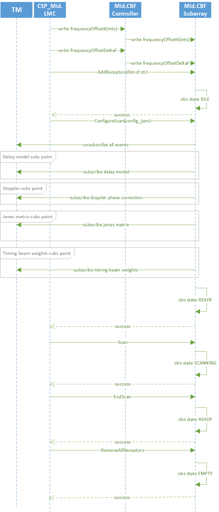

Interfaces
==========

LMC to MCS Interface
--------------------

MCS provides commands and attributes to turn MCS on and off (through the CBF Controller)
as well as commands needed to configure and execute scans through the subarrays. (CBF Subarray)

The sequence diagram below shows the interactions between LMC and MCS to assign 
receptors to a subarray, configure a scan, and run a scan. 
It shows configuration of one Mid.CBF subarray
followed by running a scan on that subarray. It ends with no receptors assigned
to the subarray. The calls to write the frequency offset K and frequency offset
delta F values are not required for every configuration and scan but must
be written to the CBF Controller before the scan configuration.

See the `ICD document <https://drive.google.com/drive/folders/1CQJAJP1RhRuSvaM1OQhnxBZZ4xH1Pq_m>`_ for details of this interface.

MCS to HPS Interface
--------------------
The interface from the MCS to the HPS is largely in the form of communication between
Tango devices running on either side. 

The interface also currently consists of low-level SSH calls from the MCS to the Talon-DX
boards, which are used to copy FPGA bitstreams and Tango device server binaries to the boards
and start the HPS Master process. This functionality may be moved in the future, but for now
it is implemented in the :ref:`TalonDxComponentManager Class`, which is instantiated by the
:ref:`CbfController`.

MCS and HPS Master DS
^^^^^^^^^^^^^^^^^^^^^
The interface between the MCS and the HPS Master device server is primarily made up
of the ``configure`` command sent from the MCS to the HPS master, which programs the
FPGA and spawns the remaining HPS device servers. Before this command can be run, it is 
expected that the MCS has already copied the necessary bitstreams and binaries to the board
and the HPS master has obviously been started. This is all handled automatically as part of
the :ref:`On Command Sequence`.

The ``configure`` command has one argument, which is a JSON-formatted string. An example
of its contents can be seen below.

.. code-block:: json

    {
        "description": "Configures Talon DX to run VCC firmware and devices.",
        "target": "talon1",
        "ip_address": "169.254.100.1",
        "ds_hps_master_fqdn": "talondx-001/hpsmaster/hps-1",
        "fpga_path": "/lib/firmware",
        "fpga_dtb_name": "vcc3_2ch4.dtb",
        "fpga_rbf_name": "vcc3_2ch4.core.rbf",
        "fpga_label": "base",
        "ds_path": "/lib/firmware/hps_software/vcc_test",
        "server_instance": "talon1_test",
        "devices": [
            "dscircuitswitch",
            "dsdct",
            "dsfinechannelizer",
            "dstalondxrdma",
            "dsvcc"
        ]
    }
