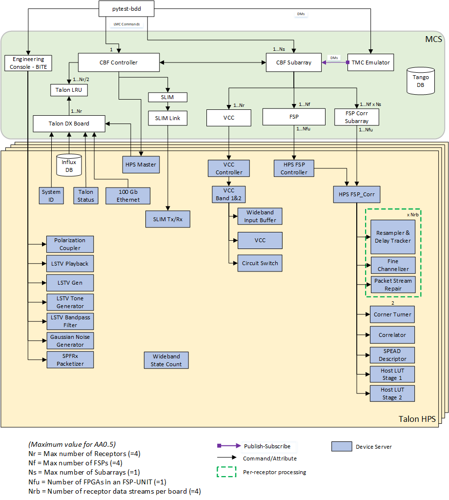

Overview
********
The Mid.CBF Master Control Software (MCS) provides a 
high-level interface to the Telescope Monitoring and Control (TMC) and 
CSP_Mid Local Monitoring and Control (LMC), and 
translates the high-level commands into the configuration and 
control of individual Talon-DX boards.

System Context
==============
The following diagram shows MCS as it fits into the rest of the CSP Mid
system.

.. figure:: ../diagrams/mcs-context.png
    :align: center

    MCS System Context

MCS interacts with TMC and CSP_Mid LMC and controls the applications and low-level
device servers that run on the hard processor system (HPS) of the Talon-DX boards.
The diagram below shows these interactions. TMC and CSP_Mid LMC interact with the 
CBF Controller and CBF Subarray. The diagram also shows the Engineering Console
and pytest-BDD elements which are used to test the interfaces between
MCS and TMC/CSP_Mid LMC during development.

In MCS there is one VCC device and one FSP device for each VCC/FSP in the system.
These devices communicate directly with the top level HPS application for the
reconfiguration of the Talon-DX functionality (VCC Controller / HPS FSP Controller)

