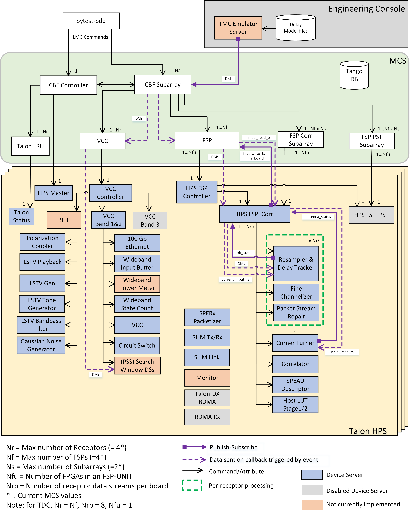

Overview
********
The Mid.CBF Master Control Software (MCS) runs on a COTS server to provide a 
high-level interface to TMC and CSP.LMC, and translate the high-level commands 
into the configuration and control of individual Talon-DX boards.

System Context
==============
The following diagram shows the Mid.CBF MCS as it fits into the rest of the CSP Mid
system.

.. figure:: ../diagrams/mcs-context.png
    :align: center

    MCS System Context

MCS interacts with TMS and CSP Mid LMC and controls the applications and low-level
device servers that run on the hard processor system (HPS) of the Talon-DX boards.
The diagram below shows these interactions. TMC and CSP Mid LMC interact with the 
CBF Controller and CBF Subarray. During development of MCS the TMC and 
CSP Mid LMC interfaces are tested using both the Engineering Console and 
pytest-BDD as shown in the diagram.

In MCS there is one VCC device and one FSP device for each VCC/FSP in the system.
These devices communicate directly with the top level HPS application for the
reconfiguration of the Talon-DX functionality (VCC Controller / HPS FSP Controller)

