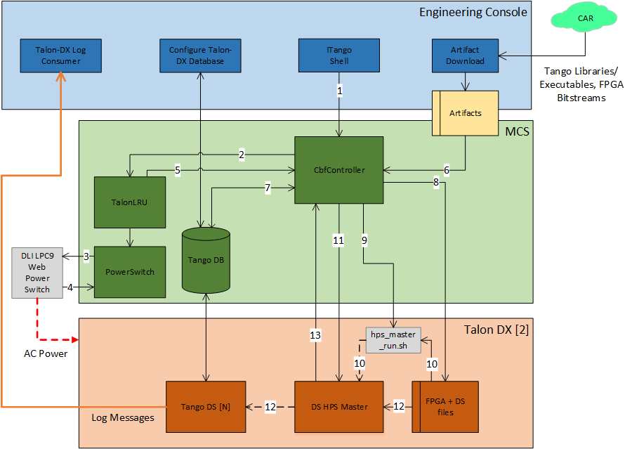

Overview
********
The Mid.CBF Master Control Software (MCS) will run on a COTS server to provide a 
high-level interface to TMC and CSP.LMC, and translate the high-level commands 
in the configuration and control of individual Talon boards.

System Context
==============
# TODO - add diagram and description to show AA0.5 MCS system context with LMC, 
TMC, 4 Talon DX boards, and Engineering Console

Interfaces
==========

LMC-MCS Interface
-----------------
# TODO - add link to ICD document

MCS-Talon Interface
-------------------

Configure
^^^^^^^^^
The Configure command is sent from the *MCS CBF Controller* to the *Talon HPS 
Master* device.

Configure Command example:

.. code-block:: json

    {
        "description": "Configures Talon DX to run VCC firmware and devices.",
        "target": "talon1",
        "ip_address": "169.254.100.1",
        "ds_hps_master_fqdn": "talondx-001/hpsmaster/hps-1",
        "fpga_path": "/lib/firmware",
        "fpga_dtb_name": "vcc3_2ch4.dtb",
        "fpga_rbf_name": "vcc3_2ch4.core.rbf",
        "fpga_label": "base",
        "ds_path": "/lib/firmware/hps_software/vcc_test",
        "server_instance": "talon1_test",
        "devices": [
            "dscircuitswitch",
            "dsdct",
            "dsfinechannelizer",
            "dstalondxrdma",
            "dsvcc"
        ]
    }

On Command Sequence
===================
# TODO - high-level description of implemented On command flow

    
    MCS On Command Sequence
